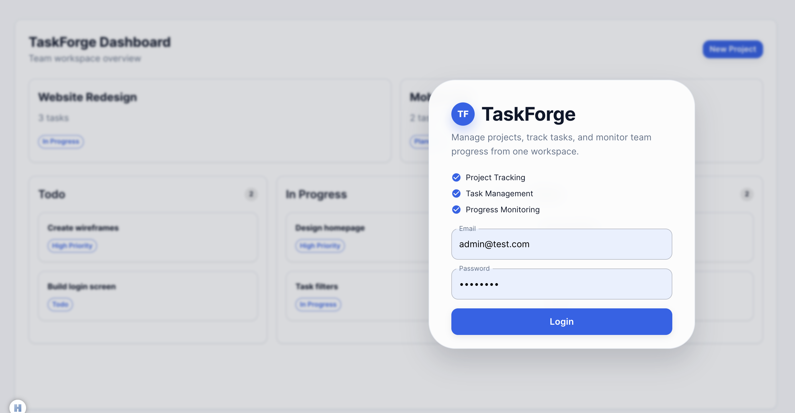
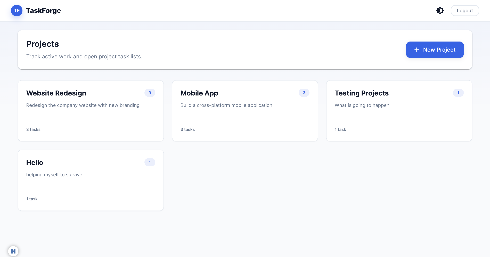
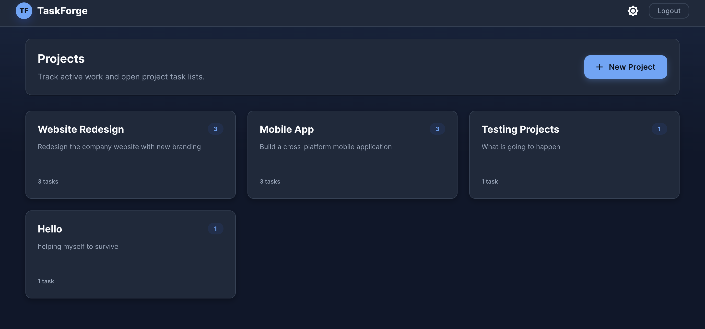
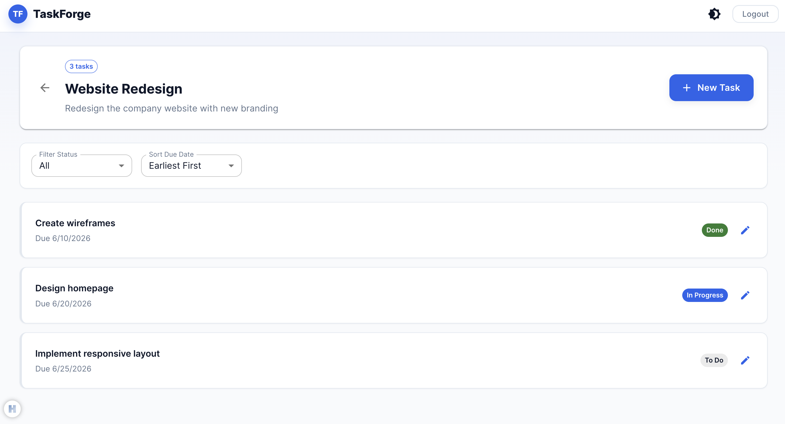
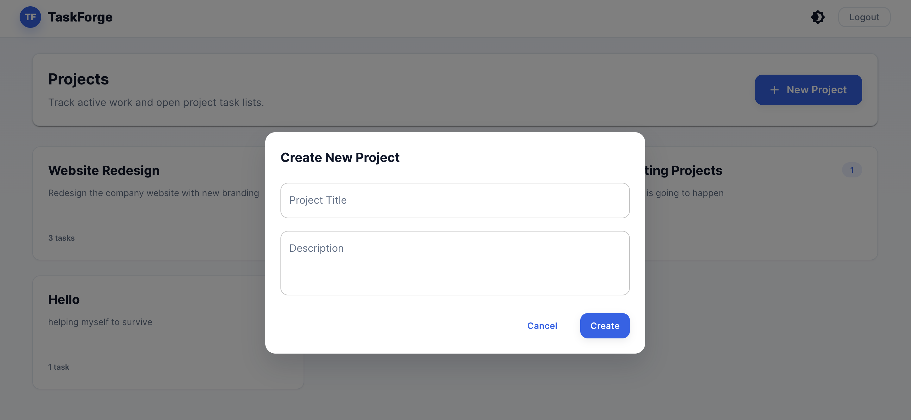
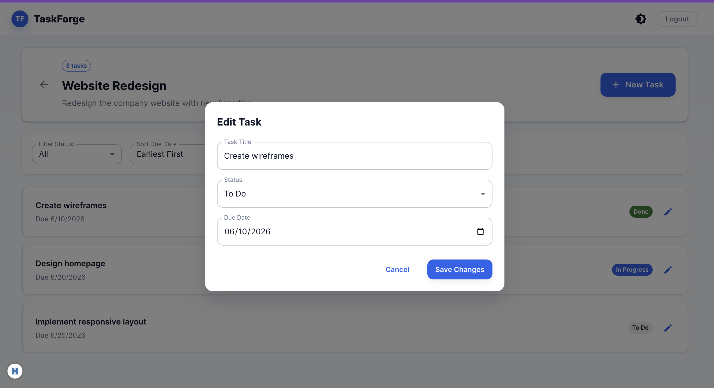

# TaskForge

A task and project management app built with React and TypeScript.

## Setup

```bash
npm install
npm run dev
```

Open [http://localhost:5173](http://localhost:5173) in your browser.

**Login credentials:**
- Email: `admin@test.com`
- Password: `22334455`

## Features

- **Authentication** — Login form with email/password validation. Session persists across page refreshes.
- **Dashboard** — Displays all projects as cards. Add new projects via a modal form.
- **Project Page** — View all tasks inside a project. Filter by status, sort by due date, and create or edit tasks.
- **Theme Switching** — Toggle between light and dark mode from the navigation bar. Preference is saved.
- **Data Persistence** — Projects, tasks, session, and theme are all saved to localStorage.
- **Loading States** — Skeleton screens are shown while data loads on the Dashboard and Project pages.
- **Error States** — Validation errors shown inline on all forms. Empty state messages when no data exists.
- **Protected Routes** — Dashboard and Project pages are inaccessible without logging in.

## Project Structure

```
src/
├── components/
│   ├── Layout.tsx          # App shell: navigation bar with theme toggle and logout
│   ├── ProjectCard.tsx     # Memoized card shown on the Dashboard for each project
│   ├── ProtectedRoute.tsx  # Redirects unauthenticated users to the login page
│   └── TaskListItem.tsx    # Memoized row shown on the Project page for each task
├── contexts/
│   ├── theme-context.ts    # Creates the React Context for theme toggling
│   └── ThemeContext.tsx    # Provides the MUI ThemeProvider and toggle logic
├── features/
│   ├── auth/
│   │   ├── auth.store.ts   # Zustand store for login/logout state
│   │   └── LoginPage.tsx   # Login form with React Hook Form + Yup validation
│   └── projects/
│       ├── project.store.ts    # Zustand store for projects and tasks CRUD
│       ├── DashboardPage.tsx   # Lists all projects, add project modal
│       └── ProjectPage.tsx     # Lists tasks for one project, filter/sort/edit
├── styles/
│   ├── styled.ts           # Emotion styled components
│   └── theme.ts            # MUI light and dark theme definitions
├── types/
│   └── domain.ts           # TypeScript interfaces for Project and Task
├── utils/
│   ├── api.ts              # Mock async data fetching with simulated delay
│   ├── persist.ts          # localStorage read/write/remove helpers
│   └── seed.ts             # Default project data loaded on first run
├── App.tsx                 # Route definitions with lazy loading and Suspense
└── main.tsx                # App entry point
```

## Tech Stack

| Technology | Purpose |
|---|---|
| React 18 + TypeScript | UI framework with full type safety |
| Material UI v5 | Component library for consistent design |
| Emotion | CSS-in-JS for scoped and dynamic styles |
| Zustand | Lightweight global state management |
| React Hook Form + Yup | Form handling and schema validation |
| React Router v6 | Client-side routing and protected routes |
| Context API | Theme state shared across the component tree |
| localStorage | Persistent storage for all app data |

## Performance Optimizations

- **`React.lazy` + `Suspense`** — Dashboard and Project pages are code-split and loaded only when visited.
- **`React.memo`** — `ProjectCard` and `TaskListItem` only re-render when their props change.
- **`useCallback`** — Event handlers are stable references, preventing unnecessary child re-renders.
- **`useMemo`** — The filtered and sorted task list in `ProjectPage` is only recalculated when the data, filter, or sort order changes.

## Screenshots

### Login



### Dashboard






### Project Tasks



### Dialogs




